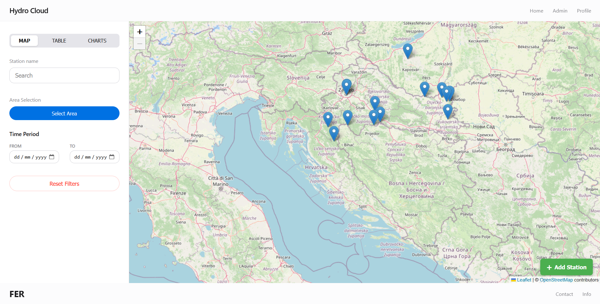

# Diplomski Projekt Frontend
This repository contains the frontend application for the 2025 Graduate Project (Diplomski Projekt).

## Browser Preview


# Running Hydro Cloud Client


## Prerequisites

Before you begin, ensure you have the following installed on your machine:

- [Node.js](https://nodejs.org/) (which includes npm)
- [Git](https://git-scm.com/)

## Installation & Setup

Follow these steps to get a local copy of the project up and running.

### 1. Clone the Repository

Open your terminal and run the following command to download the project:

```bash
git clone git@gitlab.opencode.hr:fer/ccl-diplomski-projekt-2025/diplomski-projekt-frontend.git
```

### 2. Navigate to the Project Directory

Move into the project folder:

```bash
cd diplomski-projekt-frontend
```

### 3. Install Dependencies

Install the necessary node modules listed in `package.json`:

```bash
npm install
```

### 4. Configure Environment Variables

1. Open the file named `.env` in the root directory.
2. Update the backend API URL to point to your local backend server:

```env
REACT_APP_API_URL=http://localhost:8081/api
```

### 5. Start the Development Server

Run the start script to launch the application:

```bash
npm start
```

### 6. Access the Application

Once the server starts, open your browser and navigate to:

[http://localhost:3000](http://localhost:3000)

